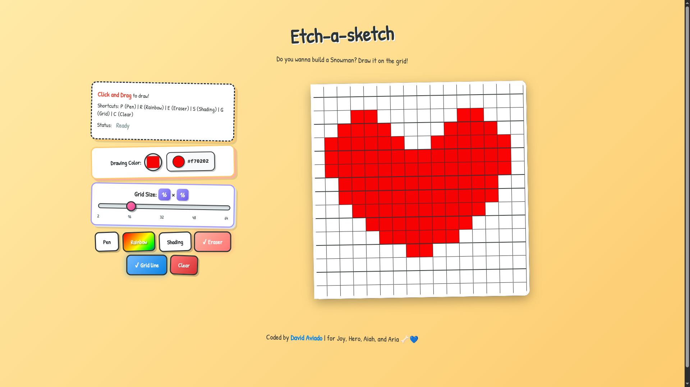
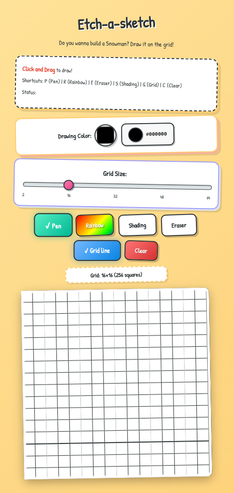

# 🎨 Etch-a-Sketch (The Odin Project)

A fully interactive, browser-based sketching pad built with Vanilla JavaScript, HTML, and CSS. This project offers a dynamic drawing experience with multiple pen modes, adjustable grid sizes, and mobile touch support.

There is also the mvp or the most basic version that uses alert prompt for user input.

## 🔗 Live Demo

[**View Live Demo**](https://exc1d.github.io/odin-etch-a-sketch/)

## ✨ Features

- **Dynamic Grid Sizing:** Adjust the canvas resolution from 2x2 up to 64x64 squares.
- **Multiple Drawing Modes:**
  - **Pen Mode:** Draw with a solid custom color.
  - **Rainbow Mode:** Paints each cell with a random RGB color.
  - **Shading Mode:** progressively darkens a cell by 10% per pass (simulating pressure).
  - **Eraser:** Resets individual cells to white.
- **Color Picker:** Choose any color using the native HTML5 color input.
- **Grid Management:** Toggle grid lines on/off for a cleaner look or precise drawing.
- **Responsive Design:** Works on desktops and includes **Touch Support** for mobile devices and tablets.
- **Keyboard Shortcuts:** Quick-switch tools using keyboard keys.

## 📸 Screenshots

## 🎮 Controls & Shortcuts

| Action                | Control                   | Keyboard Shortcut |
| :-------------------- | :------------------------ | :---------------: |
| **Pen Mode**          | Click "Pen" Button        |        `P`        |
| **Rainbow Mode**      | Click "Rainbow" Button    |        `R`        |
| **Shading Mode**      | Click "Shading" Button    |        `S`        |
| **Eraser**            | Click "Eraser" Button     |        `E`        |
| **Toggle Grid Lines** | Click "Grid Lines" Button |        `G`        |
| **Clear Canvas**      | Click "Clear" Button      |        `C`        |

## 🛠️ How It Works

This application manipulates the **Document Object Model (DOM)** to render the grid.

1.  **Grid Creation:** The grid is generated dynamically using JavaScript. We use CSS Grid (or Flexbox) to arrange the cells.
2.  **Event Listeners:**
    - `mouseover` and `mousedown` events track the mouse state to allow "click-and-drag" drawing.
    - `touchmove` events calculate the element under the user's finger (using `document.elementFromPoint`) to enable mobile drawing.
3.  **State Management:** Variables track the `currentTool`, `currentColor`, and `isMouseDown` status to determine how the cells behave when interacted with.

## 🐛 Known Issues / Future Improvements

- [ ] Add a "Save as Image" button to download drawings.
- [ ] Add a custom background color selector.

## 📝 License

This project is open source and available under the [MIT License](LICENSE).

---

Created by EXXEED

For Joy, Hero, Aiah, and Aria 🦴💙
